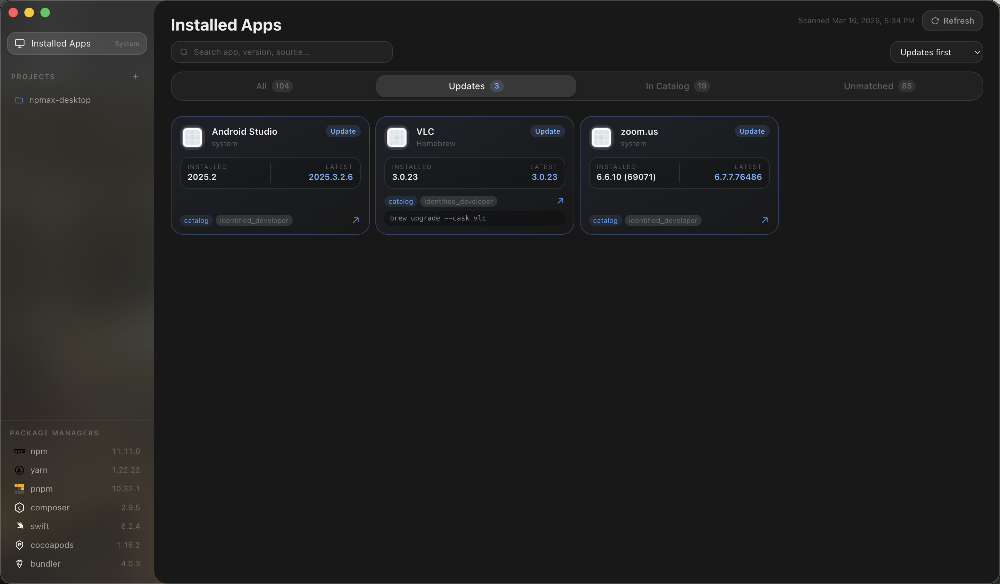
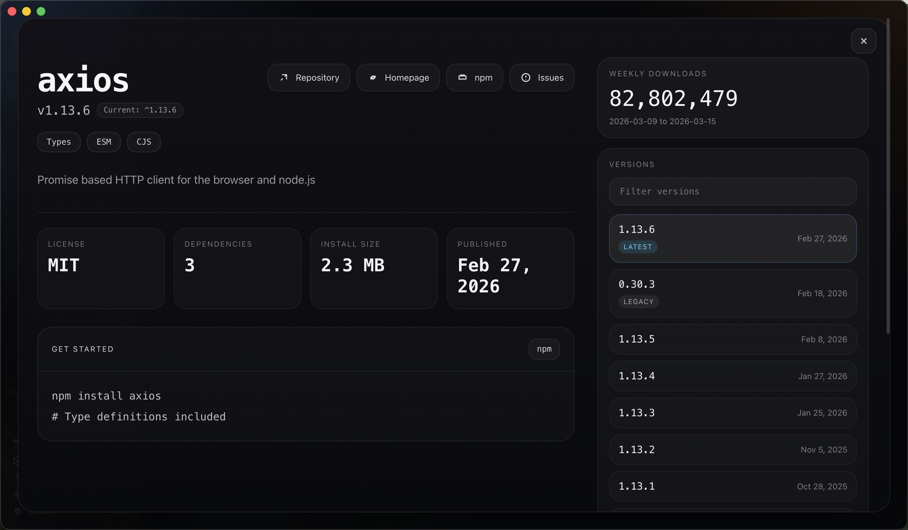
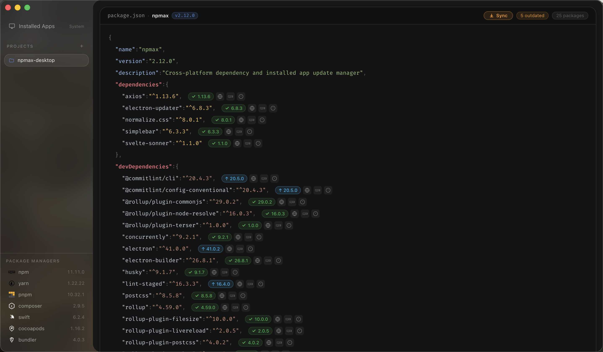

# npMax

<p align="center">
  
  
  
</p>

The open source workspace for project dependencies and installed app updates — desktop (Tauri), web analyzer, and MCP.

Runs on Linux, macOS and Windows.

Support the project and help fund `npMax Pro`:

**[Donate via Buy Me a Coffee](https://buymeacoffee.com/farobox)**

## Download npMax v3.4.6

Installers are published on GitHub Releases (Tauri builds for macOS, Windows, and Linux):

**[All Releases](https://github.com/mehdiraized/npmax/releases/)** · **[Latest](https://github.com/mehdiraized/npmax/releases/latest)**

After each release, platform assets (`.dmg`, `.exe` / NSIS, `.AppImage`, `.deb`, updater JSON) and `SHA256SUMS.txt` appear on that release page. Download the checksum file with your installer to verify the download before installing. Linux releases can additionally publish a GPG-signed checksum and its public key when release signing is configured.

Web app / landing deploys automatically to **Vercel** on every push (no GitHub Pages).

## Features

- Scan installed desktop applications on the current machine
- Surface app updates with cross-platform detection for macOS, Windows, and Linux
- Match popular apps like **Steam**, **Android Studio**, **VS Code**, **Docker**, **Discord**, **Spotify**, and more through a broader catalog
- View and manage **npm**, **yarn**, and **pnpm** packages from a `package.json`
- View and manage **Composer** (PHP) packages from a `composer.json`
- View and manage **Swift Package Manager** dependencies from a `Package.swift`
- View and manage **CocoaPods** dependencies from a `Podfile`
- View and manage **Android Gradle** dependencies from `build.gradle` / `build.gradle.kts`
- View and manage **Android Version Catalog** dependencies from `gradle/libs.versions.toml`
- View and manage **Flutter / Dart** dependencies from a `pubspec.yaml`
- View and manage **Go modules** from a `go.mod`
- View and manage **Rust crates** from a `Cargo.toml`
- View and manage **Ruby gems** from a `Gemfile`
- Detect outdated packages with live version checks against npm, Packagist, GitHub, Maven, CocoaPods, pub.dev, the Go proxy, crates.io, and RubyGems
- One-click version updates with semver prefix preservation (`^`, `~`, etc.)
- Lock file status indicator with Install / Sync button
- Installed Apps dashboard with search, filters, update badges, and refresh actions
- Supports multiple projects in a sidebar
- Cross-platform desktop via **Tauri 2**, plus browser analyzer and **MCP** server

### Installed apps support

- Scans installed apps from the current operating system instead of requiring a project folder first
- Detects updates from native package managers where possible, including Homebrew Casks, winget, Flatpak, and Snap
- Falls back to a curated app catalog with platform-specific identifiers and official release sources
- Shows installed version, latest detected version, update source, and suggested update command when available
- Keeps the multi-project dependency workflow intact beside the Installed Apps area

### Supported project files

npMax automatically detects supported project manifests and displays the appropriate editor:

- `package.json` for npm, yarn, and pnpm projects
- `composer.json` for Composer projects
- `Package.swift` for Swift Package Manager projects
- `Podfile` for CocoaPods projects
- `build.gradle` / `build.gradle.kts` for Android Gradle projects
- `gradle/libs.versions.toml` for Android Version Catalog projects
- `pubspec.yaml` for Flutter and Dart projects
- `go.mod` for Go modules
- `Cargo.toml` for Rust / Cargo projects
- `Gemfile` for Ruby / Bundler projects

### Ecosystem support details

For Composer projects:

- Fetches the latest stable version of each package from [Packagist](https://packagist.org)
- Skips platform requirements (`php`, `ext-*`, `lib-*`) — only real packages are checked
- Preserves your version constraint prefix on update (`^`, `~`, `>=`, etc.)
- Detects `composer.lock` status and offers a one-click `composer install`

For Apple projects:

- Reads dependencies from `Package.swift` and `Podfile`
- Resolves Swift package updates from GitHub releases and tags
- Resolves CocoaPods updates from CocoaPods trunk metadata
- Detects `Package.resolved` / `Podfile.lock` drift and offers sync actions

For Android projects:

- Reads direct dependencies from `build.gradle` / `build.gradle.kts`
- Reads library entries from `gradle/libs.versions.toml`
- Resolves artifact versions from Google Maven and Maven Central
- Detects Gradle lockfile drift where lock files are present

For Flutter projects:

- Reads `dependencies` and `dev_dependencies` from `pubspec.yaml`
- Resolves latest stable releases from [pub.dev](https://pub.dev)
- Detects `pubspec.lock` drift and offers a one-click `flutter pub get`

For Go, Rust, and Ruby projects:

- Reads dependencies from `go.mod`, `Cargo.toml`, and `Gemfile`
- Resolves latest versions from the Go proxy, crates.io, and RubyGems
- Detects `go.sum`, `Cargo.lock`, and `Gemfile.lock` drift
- Offers one-click sync flows with `go mod tidy`, `cargo check`, and `bundle install`

## Monorepo structure

```
apps/web        Next.js landing + browser analyzer + API
apps/desktop    Tauri 2 + React/Vite desktop app
apps/mcp        @npmax/mcp Model Context Protocol server
packages/types  Shared TypeScript types
packages/core   Parsers, registries, advisory heuristics
packages/api-client  Typed HTTP client for Next API
packages/ui     Shared React components
packages/app-shell   Shared app shell (sidebar, editors, storage)
```

## Prerequisites

- Node.js 20+
- [pnpm](https://pnpm.io) 9+
- For desktop: [Rust](https://rustup.rs) + [Tauri prerequisites](https://v2.tauri.app/start/prerequisites/)

## Setup

```bash
pnpm install
```

## Develop

```bash
pnpm dev:web       # http://localhost:3000
pnpm dev:desktop   # Tauri window (requires Rust)
pnpm dev:mcp       # MCP stdio server
```

Please read our [Contributing Guide](./CONTRIBUTING.md) before submitting a Pull Request.

## MCP (Cursor)

```json
{
	"mcpServers": {
		"npmax": {
			"command": "npx",
			"args": ["-y", "@npmax/mcp"],
			"env": {
				"NPMAX_API_URL": "https://npmax.vercel.app"
			}
		}
	}
}
```

`NPMAX_API_URL` is optional — without it the MCP talks to registries directly via `@npmax/core`.

## Building for production

Desktop (local smoke build):

```bash
pnpm build:desktop
```

Artifacts land under `apps/desktop/src-tauri/target/release/bundle/`.

CI builds multi-platform installers on push to `master` (see `.github/workflows/release.yml`). Signing / notarization notes: `PRODUCTION.md`.

Web builds on Vercel from the repo root (`vercel.json`).

## Community support

- [GitHub](https://github.com/mehdiraized/npmax) (Bug reports, Contributions)
- [Buy Me a Coffee](https://buymeacoffee.com/farobox) (Support development and help fund npMax Pro)

## License

MIT
